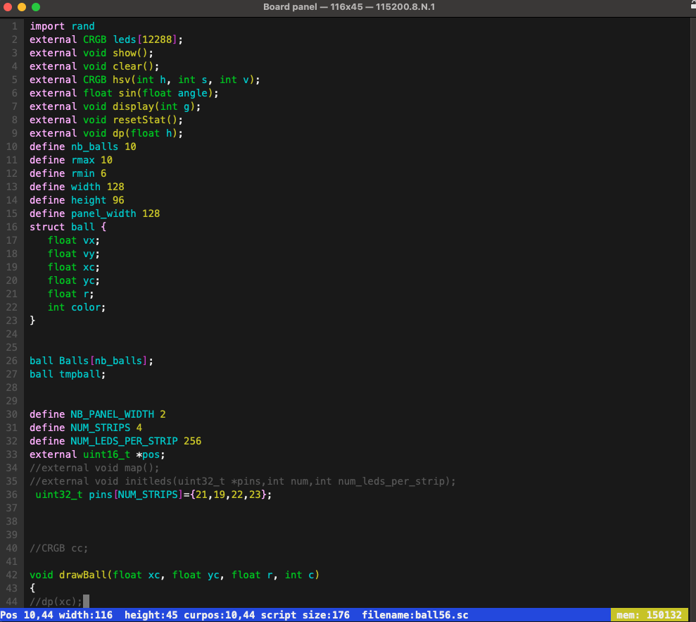

# Introduction
For a very long time now I have been looking at being able to execute programs on the esp32 without having to load the code via any IDE(Arduino, VSCode ...).
I rapidly forgot that topic and focus my energy on writing leds driver and artnet libraries for the esp32. Once that done, I start thinking again about being able to write animations 'live'. Of course in my searches for existing previous implementations, I fell upon PixelBlaze and later Arti-Fx (part of the WLED MoonModules).
In both cases the scripting lanquage is a subset of JavaScript and to my knowkledge interpreted.
A number of impressive animations have already been written for both these environments and PixelBlaze has a full web based accessible examples library to which one can contribute.
WLED Arti-Fx and PixelBlaze both have a web interface to program the animations.
PixelBlaze is a closed/licensed product so no way to 'look' into it and I haven't installed Arti-Fx I have to admit :). Hence I do not have any real clue about the performance of these two implementations.
 
Several interpreted scripting lanquages are available (Lua, JavaScript, Gravity, ...) for the esp32, I have tried Lua and Gravity on my panel (48 16x16 ws2812 panels or 12288 leds) the refresh rate  of the panel is 128fps thanks to my VirtualLedDriver.
The results were quite a let down in term of performance. For a simple rainbow animation the global frame rate comparison is:
* 85 fps: for the C++ program uplaod via arduino
* 10 fps: for Gravity script
*  3 fps: for Lua script
 
This is indeed due do the large number of pixels needed to be calculated for my panel. Hence none of these language will make the cut for me.

In the sc_examples directory you will find examples of complexe scripts.
 
**So I have decided also give it a go. Can I also conceive a 'language' to program led animations.**
 

<!-- TOC start (generated with https://github.com/derlin/bitdowntoc) -->

- [Which Language ?](#which-language-)
   * [C like language](#c-like-language)
   * [DYI parser and compiler](#dyi-parser-and-compiler)
   * [Not a development environment](#not-a-development-environment)
   * [Led manipulation oriented](#led-manipulation-oriented)

- [First Light](#first-light)
  * [Error object](#error-object)
  * [Deleting an executable](#deleting-an-executable)

- [The function you call can have input parameters](#the-function-you-call-can-have-input-parameters)

- [Interaction with pre compiled functions](#interaction-with-pre-compiled-functions)
  * [Calling/accessing 'pre compiled' functions/variables from ESPScript](#callingaccessing-pre-compiled-functionsvariables-from-espscript)
  * [Access to 'pre compiled' variables](#access-to-pre-compiled-variables)
  * [Calling 'pre-compiled' functions](#calling-pre-compiled-functions)
- [Safe mode and arrays](#safe-mode-and-arrays)

- [Variables types](#variables-types)
  * [Arrays and multidimensional arrays](#arrays-and-multidimensionnal-arrays)
  * [Objects](#objects)

- [What you can do with the language](#what-you-can-do-with-the-language)
  * [Use of define](#use-of-define)

- [Running scripts in the background](#running-scripts-in-the-background)
  * [How to cope with several binaries](#how-to-cope-with-several-binaries)
  * [Task synchronization](#task-synchronization)
  * [Pre and post kill](#pre-and-post-kill)

- [Conclusion](#conclusion)

<!-- TOC end -->


 
<!-- TOC --><a name="which-language-"></a>
# Which Language ?
Being old school, I know that assembly language is the way to get the most of performance out of a CPU (given that your skills at writing ML are quite good of course). So I've tried to duplicate the same program directly assembly (still using arduino) and it worked great.
 
So I wrote an assembly language compiler as well as a small terminal interface to edit/save/compile/execute these programs (It will later become [ledOS](https://www.github.com/hpwit/LedOS) )

Of course proposing an assembly parer is not a really something usable :) so I took my chance at writing a compiler which will produce assembly languages for the esp32 xtensa CPU. 

<!-- TOC --><a name="c-like-language"></a>
## C like language
I have chosen to go for a C like syntax which is closed to JavaScript with stronger typing. I have made a loose adaptation of the language. But you can write thing like this:
 
 ```C
 void main()
{
setTime();
resetStat(); 
  int h = 1 ;
  while (h > 0)
  {
    beforeRender();
    for (int i = 0; i < width; i++)
    {
      for (int j = 0; j < height; j++)
      {
        render2D(i, j);
      }
    }
    show();
  }
}
 ```

<!-- TOC --><a name="dyi-parser-and-compiler"></a>
## DYI parser and compiler
I am not a compiler specialist and I wrote 'by hand' the parser and compiler using no existing grammar. Please do not throw me into the fire for this. The entire exercice has been a learning experience also and the result is not half cooked (according to me).

Later in this documentation you will see what is possible and not.

<!-- TOC --><a name="not-a-development-environment"></a>
## Not a development environment
This libray doesn't provide an environment to write scripts. Nevertheless it has been included in:
- [LedOS](https://github.com/hpwit/ledOS) : an environment in a console terminal to edit, save and execute programs



- [MoonModules StarLight](https://github.com/MoonModules/StarLight) : Web enabled ESP32 application for LED manipulation based on WLED which contains several modules (artnet, DMX, powerful mapping tool ....) [Live Scripts doc](https://ewowi.github.io/StarDocs/UserMod/UserModLiveScripts)


<!-- TOC --><a name="led-manipulation-oriented"></a>
## Led manipulation oriented
Even if the language is made to be of general application, the target of this language is targeted at creating led animations.
As a consequence the scripting language has some limitations that 


<!-- TOC --><a name="first-light"></a>
# First light :)

- To create a new instance of a parser : ``Parser _parser;`` 
- To parse a script and create an executable : ``Executable exec=_parser.parseScript(&script);``
- To execute the code assuming there is function called main in you code: ``exec.execute("main");``


If you execute the following program [firstlight.ino](examples/firstlight/firstlight.ino):

 ```C
#include "ESPLiveScript.h"

string script="\
void main()\n\
{\n\
for(int i=0;i<20;i++)\n\
    {\n\
        printfln(\"i:%2d 3xi:%2d\",i,3*i);\n\
    }\n\
}";
void setup() {
  // put your setup code here, to run once:
  Serial.begin(115200);
  Parser _parser;
  Executable exec=_parser.parseScript(&script);
  if(exec.isExeExists())
  {
    exec.execute("main");
  }
  else
  {
    Serial.println(exec.error.error_message.c_str());
  }

}

void loop() {
  // put your main code here, to run repeatedly:

}
 ```
the output will be:
```
***********PARSING DONE*********
***********COMPILING DONE*********
max used memory: 7064 maxstack:2156  started 265960 free mem:258796 consumed 7164 time:30ms
max used memory: 7064 maxstack:2156  started 265960 free mem:262940 consumed 3020 time:41ms
***********AFTER CLEAN*********
***********CREATE EXECUTABLE*********
Creation of an 208 bytes binary and 70 bytes data
Parsing 75 assembly lines ...
max used memory: 7064 maxstack:2156  started 265960 free mem:265000 consumed 960 time:104ms
i: 0 3*i: 0
i: 1 3*i: 3
i: 2 3*i: 6
i: 3 3*i: 9
i: 4 3*i:12
i: 5 3*i:15
i: 6 3*i:18
i: 7 3*i:21
i: 8 3*i:24
i: 9 3*i:27
i:10 3*i:30
i:11 3*i:33
i:12 3*i:36
i:13 3*i:39
i:14 3*i:42
i:15 3*i:45
i:16 3*i:48
i:17 3*i:51
i:18 3*i:54
i:19 3*i:57
```

**NB: if you have several functions it the same script you can call any of the function**

## Error object
the `Executable` class has an `error` member
- `error`: 1 if an error occured during the compiling
- `error_message` : the error message
- `line` and `pos` : line and position in the script where the error was found (this information is also in the `error_message`)


## Deleting an executable

To delete an executable hence freeing the used memory by the binary use: `exec.free()`

<!-- TOC --><a name="the-function-you-call-can-have-input-parameters"></a>
# The function you call can have input parameters

To add parameter to the exection call
```C
Arguments args;
args.add(1);
args.add(2.3);
...
exec.execute("main", args);
```
**NB: For the moment you can only have interger and float entry parameters**

In this example we do calculate the factorial:
```C
#include "ESPLiveScript.h"

string script="\
int fact(int h)\n\
{\n\
   if(h==1)\n\
   {  \n\
     return 1;\n\
   }  \n\
  return h*fact(h-1);\n\
}\n\
\n\
void main(int g)\n\
{  \n\
   printfln(\"factorial of %d is %d\",g,fact(g));\n\
}";

void setup() {
  // put your setup code here, to run once:
Serial.begin(115200);

Parser p;
Executable exec=p.parseScript(&script);
if(exec.isExeExists())
{
  Arguments args;
  args.add(5);
  exec.execute("main",args);
  args.clear();
   args.add(6);
  exec.execute("main",args);
   args.clear();
   args.add(7);
  exec.execute("main",args);
}

}

void loop() {
  // put your main code here, to run repeatedly:

}
```


result:
```
***********PARSING DONE*********
***********COMPILING DONE*********
max used memory: 8468 maxstack:2304  started 265896 free mem:257328 consumed 8568 time:33ms
max used memory: 8468 maxstack:2304  started 265896 free mem:262196 consumed 3700 time:44ms
***********AFTER CLEAN*********
***********CREATE EXECUTABLE*********
Creation of an 272 bytes binary and 90 bytes data
Parsing 98 assembly lines ...
max used memory: 8468 maxstack:2304  started 265896 free mem:264808 consumed 1088 time:121ms
factorial of 5 is 120
factorial of 6 is 720
factorial of 7 is 5040
 ```

<!-- TOC --><a name="interaction-with-pre-compiled-functions"></a>
# Interaction with pre compiled functions

<!-- TOC --><a name="callingaccessing-pre-compiled-functionsvariables-from-espscript"></a>
## Calling/accessing 'pre compiled' functions/variables from ESPScript

With the ESPScript is not able to code everything with the same efficiency as the espressif compiler plus it doesn't gfive you accès to WiFi, bluetooth, SPI, I2C, ... Futhermore, it will not be concievable to rewrite functions like the one the the FastLED library or any other library. Hence the ESPScript can call pre-compiled functions. In other case you can need to access a 'precompile' variable which is changed by another process for instance.


<!-- TOC --><a name="access-to-pre-compiled-variables"></a>
## Access to 'pre compiled' variables
You need in your sketch that your variable needs to be accessible from the scripts:
```
addExternal("name_of_the_variable_int_the_script", externalType::value, (void *)&address_to_the_variable);
```

In your script you need to declare your variable as external:
```
external type name_of_the_variable_int_the_script;
```
You  read and write the variables. 
NB: a variable can also be an array.

Example:
```C
#include "ESPLiveScript.h"

string script="\
external int value;\n\
external uint16_t *array;\n\
//external uint16_t array[10]; is the same \n\
void fillArray()\n\
{\n\
  for(int i=0;i<10;i++)\n\
  {\n\
    array[i]=i*3;\n\
  }\n\
}\n\
void change()\n\
{\n\
value=value+2;\n\
}\n\
void main()\n\
{  \n\
   printfln(\"value: %d \",value);\n\
}";

int variable=0;
uint16_t _array[10];
void setup() {
  // put your setup code here, to run once:
Serial.begin(115200);

Parser p;
addExternal("value", externalType::value, (void *)&variable);
addExternal("array", externalType::value, (void *)_array);
Executable exec=p.parseScript(&script);
if(exec.isExeExists())
{
  
 variable=5;
 exec.execute("main");
  variable=240;
 exec.execute("main");
 variable=15;
 printf("old value:%d ",variable);
 exec.execute("change");
 printf("new value:%d\n",variable);
 exec.execute("fillArray");
 for (int i=0;i<10;i++)
 {
  printf("%d:%d\n",i,_array[i]);
 }
}

}

void loop() {
  // put your main code here, to run repeatedly:

}
```

NB: here we did call three different functions all defined in the script.

Result:
```
***********PARSING DONE*********
***********COMPILING DONE*********
max used memory: 9172 maxstack:2112  started 265376 free mem:256100 consumed 9276 time:40ms
max used memory: 9172 maxstack:2112  started 265376 free mem:261868 consumed 3508 time:52ms
***********AFTER CLEAN*********
***********CREATE EXECUTABLE*********
Creation of an 264 bytes binary and 75 bytes data

Parsing 99 assembly lines ...

max used memory: 9172 maxstack:2112  started 265376 free mem:264168 consumed 1208 time:129ms
 value: 5 
value: 240 
old value:15 new value:17
0:0
1:3
2:6
3:9
4:12
5:15
6:18
7:21
8:24
9:27
```

<!-- TOC --><a name="calling-pre-compiled-functions"></a>
## Calling 'pre-compiled' functions
You can call 'core' functions which would be to complicated to reproduced in scripting (like fft , showing leds ...)

```
addExternal("funtion name", externalType::function, (void *)function);
```
In your script you need to declare your variable as external:
```
external type function_name;
```

Example
```C
#include "ESPLiveScript.h"

string script="\
external float calc(int h);\n\
external void displayfloat(float nb);\n\
void main()\n\
{\n\
 float h=calc(52);\n\
 displayfloat(h);\n\
}";

void displayfloat(float nb)
{
  printf("from pre-compiled %f\n",nb);
}

float calcul(int pos)
{
  return (float)(pos/34.0);
}

void setup() {
  // put your setup code here, to run once:
Serial.begin(115200);

  addExternal("calc", externalType::function, (void *)calcul);
  addExternal("displayfloat", externalType::function, (void *)displayfloat);
Parser p;
Executable exec=p.parseScript(&script);

if(exec.isExeExists())
{
 exec.execute("main");
}

}

void loop() {
  // put your main code here, to run repeatedly:

}
```

Result:
```
***********PARSING DONE*********
***********COMPILING DONE*********
max used memory: 7572 maxstack:1964  started 265984 free mem:258484 consumed 7500 time:28ms
max used memory: 7572 maxstack:1964  started 265984 free mem:263600 consumed 2384 time:40ms
***********AFTER CLEAN*********
***********CREATE EXECUTABLE*********
Creation of an 160 bytes binary and 56 bytes data

Parsing 59 assembly lines ...

max used memory: 7572 maxstack:1964  started 265984 free mem:265124 consumed 860 time:92ms
from pre-compiled 1.529412
```


<!-- TOC --><a name="safe-mode-and-arrays"></a>
# Safe mode and arrays

Let's consider the following Use case:

In your c++ code
```C
uint16_t _array[10];
addExternal("array", externalType::value, (void *)_array);
```

and the script
```C
external uint16_t *array; //or external uint16_t array[10];

void main()
{
  for(int i=0;i<200;i++)
  {
    array[i]=200;
  }
}
```
the script will write out of bounds of the array with unintended consequences.

To avoid this you can use the safemode:
```C
safe_mode
external uint16_t array[10];

void main()
{
  for(int i=0;i<200;i++)
  {
    array[i]=200;
  }
}
```

you will get

```
***********PARSING DONE*********
***********COMPILING DONE*********
max used memory: 7988 maxstack:2112  started 265528 free mem:257492 consumed 8036 time:32ms
max used memory: 7988 maxstack:2112  started 265528 free mem:262424 consumed 3104 time:44ms
***********AFTER CLEAN*********
***********CREATE EXECUTABLE*********
Creation of an 232 bytes binary and 60 bytes data
Parsing 82 assembly lines ...
max used memory: 7988 maxstack:2112  started 265528 free mem:264784 consumed 744 time:111ms
Overflow error line 0 max size: 10 got 11
```

NB: As the check will be done everytime a write is done then it will slow the script down.

<!-- TOC --><a name="variables-types"></a>
# Variables types

Here are the default types:
 * `uint8_t`
 * `char`
 * `bool` : `true`, `false`
 * `int` 
 * `s_int` : int over 2 bytes
 * `uint16_t`
 * `uint32_t`
 * `float`
 * `CRGB`
 * `CRGBW`

## Arrays and multidimensionnal arrays
 
You can manage arrays:
```
//example of definitions
int array[23]; 
int array2D[y][x]; //you can also write int arrayx_y[y,x];
int array3D[z][y][x];  //or int arrayx_y_x[z,y,x]; 

//usage

int h=array3D[23][12][2];

```

<!-- TOC --><a name="objects"></a>
## Objects

You can define new types call `Objects`

example:
```C
Objects new_type
{
  float k;
  int l;
}
```
 
The structures can have methods

```C
Objects new_type
{
  float h;
  int l;
  void display()
  {
    printf("l :%d\n",l);
  }
}
```
NB: not like in a class you do not have constructor or destructor (at least not yet :) ).

Example:
```C
#include "ESPLiveScript.h"

string script="\
Object new_type\n\
{\n\
  float f;\n\
  int index;\n\
  void display(int multi)\n\
  {\n\
    printfln(\"from object:%d\",multi);\n\
  }\n\
  void func2() \n\
  {\n\
    display(f*index);\n\
  }\n\
}\n\
\n\
new_type var;\n\
void main()\n\
{\n\
 var.f=0.8;\n\
 var.index=12;\n\
 var.func2();\n\
 var.display(23);\n\
}";


void setup() {
  // put your setup code here, to run once:
Serial.begin(115200);

Parser p;
Executable exec=p.parseScript(&script);
if(exec.isExeExists())
{
 exec.execute("main");
}

}

void loop() {
  // put your main code here, to run repeatedly:

}
```

Result:
```
***********PARSING DONE*********
***********COMPILING DONE*********
max used memory: 11060 maxstack:1836  started 265840 free mem:254916 consumed 10924 time:40ms
max used memory: 11060 maxstack:1836  started 265840 free mem:260924 consumed 4916 time:52ms
***********AFTER CLEAN*********
***********CREATE EXECUTABLE*********
Creation of an 312 bytes binary and 104 bytes data
Parsing 114 assembly lines ...
max used memory: 11060 maxstack:1836  started 265840 free mem:263380 consumed 2460 time:147ms

from object:9
from structobjecture:23
```
NB 1: you can have arrays of objects : `new_type arr[10] `

NB 2: the functions needs to be in order i.e you cannot all a function which has not be defined previously. (for the moment)

NB 3: Due to some memory alignment concern, for the moment you need to order the variable by order of size. Here is the order of size:
  - `float, uint32_t, int`
  - `s_int, uint16_t`
  - `uint8_t, CRGB, CRGBW`


i.e :
```C
Object varname
{
char c;
uint16_t k;
float h;
}

will not work. you need to arrange your data as such

Object varname
{
  float h;
  uint16_t k;
  char c;
}
```

# What you can do with the language

Like any normal language you can have:
- loops (`while` , `for`)
- `break` , `continue`
- testing : `if` ,`else` ,`(test)?true_statement:false_statement`
- `++`,`--`: for integers and pointers
- `+=`,`-=`,`/=`,`*=`
- pointers
- `^` for power
- `>>` and `<<`
- type convertion `(float)` , `(int)`
    NB: the convertion float <-> int is automatic
- `define` : see below
- predefined functions:
  * `printf` , `pritnfln` only for intergers for now.
  * `fabs`, `abs` other to come

## Use of define

More or less like in C you can have pre-process instructions with a limited scope for now

```C
define TOKEN 25

if(i<TOKEN)
{
  ...
}

vill be compiled as

if(i<25)
{
  ...
}
```
Of course you can have this
```C
define p printf
...
p("here %d\n",25);
```

NB: there is no macro yet


# Running scripts in the background

You have the possibility of running scripts as task in the background (interesting when you want several tasks at once):

- `exec.executeAsTask("function_name")`
- `exec.executeAsTask("function_name",arguments)`
- `exec.executeAsTask("function_name", __RUN_CORE, args)`

When using this you can also do the following

- `exec.suspend()`
- `bool exec.isRunning()`
- `exec.estart()`
- `exec.kill()` : will not delete the binary hence will not free the memory use `exec.free()`

## How to cope with several binaries

When you deal with several binaries, it could get complicated to follow a lot of different variables.
You can 'register' your executable in the Script runtime:

`scriptRuntime.addExe(executable exec,string exename)`

```C
string script1="...";
string scrip2="...";

 Executable exec=p.parseScript(&script1);
 if(exec.isExeExists())
{
  scriptRuntime.addExe(exec,"script1");
}
exec=p.parseScript(&script2);
 if(exec.isExeExists())
{
  scriptRuntime.addExe(exec,"script2");
}

...

scriptRuntime.execute("script1");
scriptRuntime.execute("script2");
```

Here are all the functions of the scriptRuntime:
- `scriptRuntime.addExe(executable exec,string exename)`
- `scriptRuntime.excute(string execname)` : the runtime will execute the "main" function by default
- `scriptRuntime.excute(string execname,string function_name)`
- `scriptRuntime.excute(string execname,Arguments args)`:: the runtime will execute the "main" function by default
- `scriptRuntime.excute(string execname,Arguments args,string function_name)`
- `scriptRuntime.excuteAsTask(string execname)`: : the runtime will execute the "main" function by default
- `scriptRuntime.excuteAsTask(string execname,string function_name)`
- `scriptRuntime.excuteAsTask(string execname,Arguments args)`: the runtime will execute the "main" function by default
- `scriptRuntime.excuteAsTask(string execname,Arguments args,string function_name)`
- `scriptRuntime.excuteAsTask(string execname,Arguments args)` : the runtime will execute the "main" function by default
- `scriptRuntime.excuteAsTask(string execname,int core,Arguments args)` : the runtime will execute the "main" function by default
- `scriptRuntime.kill(string execname)` : this will not free the memory
- `scriptRuntime.deleteExe(string execname)` : will free the memory of the binary
- `Executable *findExecutable(string execname)`
- `vector<exe_info> scriptRuntime.getListExecutables()` : will list all the executables:
- `exe_info getExecutableInfo(string execname)`
  * exe_info:
    + `uint16_t data_size`
    + `uint16_t binary_size`
    + `uint16_t total_size`
    + `bool isRunning`
    + `string name`

## Tasks synchronization
As discussed earlier  this scripting language aims at being used primarily for leds animations. when you have several scripts running at the same time it is important to synchronize the script to avoid artifacts:


Let's say that you need to synchronize the show function which is an 'pre-compiled' function.
in your C/C++ program add this:
```C
void show()
{
  ...
  driver.showPixel();
  ...
}


string script1="
...

while(2>1)
{
rainbow();
sync(); //put this instead of show();
}";
string script2="
...

while(2>1)
{
gameoflife();
sync(); //put this instead of show();
}";
void setup()
{
runningPrograms.setFunctionToSync(show);
Parser p;
scriptRuntime.addExe(p.parseScript(&script1,"exe1"));
scriptRuntime.addExe(p.parseScript(&script2,"exe2"));
scriptRuntime.executeAsTask("exe1");
scriptRuntime.executeAsTask("exe2");
}

```

## Pre and post kill
When you kill a task you cannot control where exactly in the program it will be stopped. As a consequence it could be stopped when calling an external function with interupts or calling another background task.

For instance in the case of the I2SClockLessDriver and the I2SVirtualClocklessDriver it is necessary to stop the driver from displaying anything before killing the script.

this is done as such :
```C
void pre() {
  driver.__enableDriver = false;
  while (driver.isDisplaying) {};
}

void post() {
  driver.__enableDriver = true;
}

..
void setup()
{
  ...
 runningPrograms.setPrekill(pre, post);
 ...
}
```

# Conclusion

This is my first try at creating such a thing. You can see a video of me talking about it [live on youtube](https://www.youtube.com/watch?v=iOzKHQxdNJM) where I use the compiler with ledOS.

Please have a look at [Starlight](https://github.com/MoonModules/StarLight/commit/42cb1b8db689b097774bf7640c768d880337567c)

I will add an issue for all the functionalities you want to see added in the; compiler.

As always enjoy and have fun.


